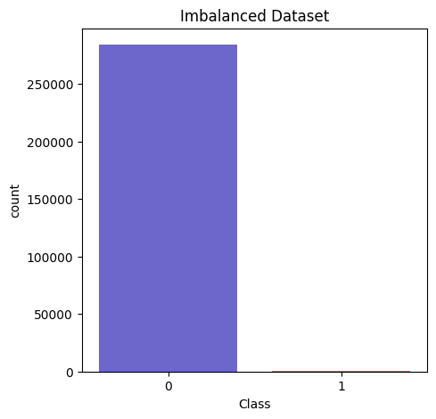
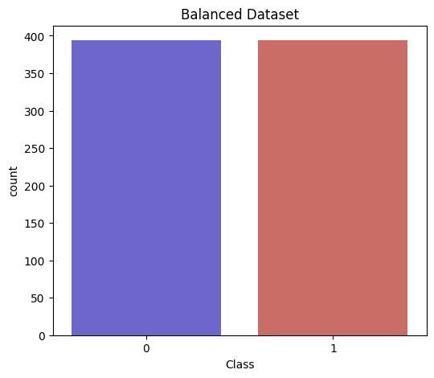
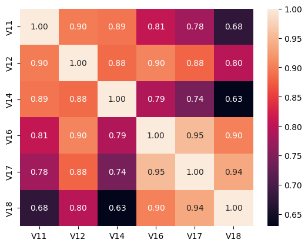
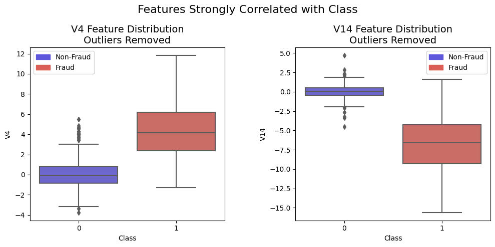
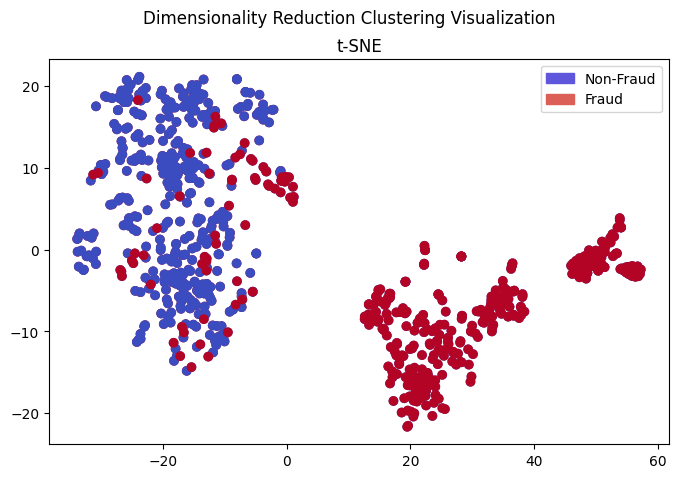
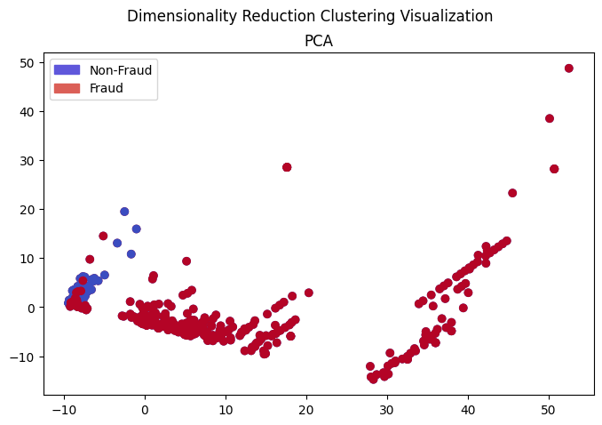
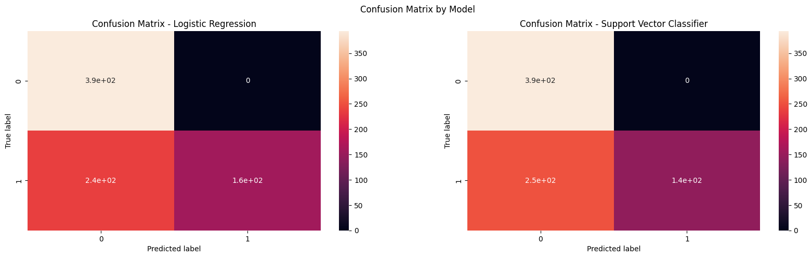
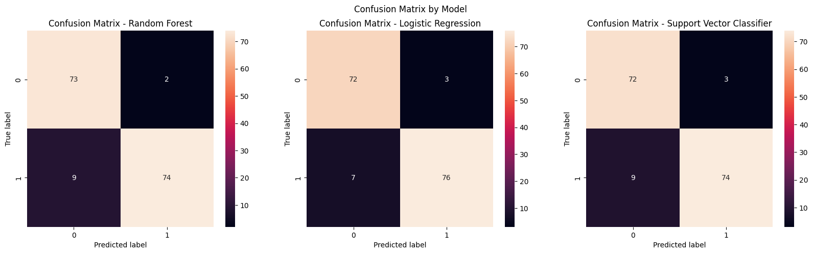
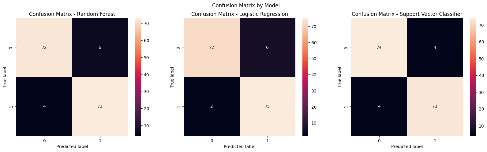

# Credit Card Fraud Detection

This notebook is dedicated to the study and prediction of credit card fraud from a large transaction dataset.
Follow the link to access the [github page](https://chris-caballero.github.io/Fraud-Transaction-Detection/) to see the notebook and results!

## Update 9/6/2023
### **XGBoost Model for Predictions**
- I was able to use AI Platform on GCP to replicate my local model training procedure and deploy a trained XGBoost model for credit card fraud detection.
- Trained this model using the cleaned data stored in Google Cloud Storage (GCS) and deployed it on Google AI Platform.
- To make predictions with the XGBoost model, check out the notebook: `src/notebooks/xgboost-serving.ipynb`.
  - This notebook calls a Google Cloud Function to serve predictions from the deployed model
    - Code provided in: `src/cloud/cloud_predict_json.py`
  - It also loads the saved output model from GCS into local memory and uses it for local predictions.

## Requirements

### Using **Python Virtual Environments**:
- run `pip install -r requirements.txt` while in your virtual env.
- Check out the notebooks:
    - `src/notebooks/*`

## Goal
The goal of this project is to get direct experience performing data exploration and analysis on imbalanced data. Improving data quality and consistency is paramount in developing effective models in production environments, so I hoped to try some techniques for handling data (such as sampling techniques and interquartile range outlier removal). I was able to generate some visualizations showcasing the distribution of key features and the joint distributions of those highly correlated with the class.

I used a variety of statistical models: Logistic Regression, Support Vector Classifier, Random Forest, and XGBoost. To see which performed best and had the most significant transfer of performance to the validation set. Most results can be found in the GitHub pages linked at the top of the README.

## Results
Here I will display the visualizations which capture key aspects of the project.

### **Exploratory Data Analysis**

- Class Imbalance, before and after Random Undersampling:

    
    

- Correlation Matrix (balanced dataset):
 

- Correlation Matrix (balanced dataset) - Highly correlated features:
    - In the future I will use this information to perform feature selection.
 

- Known features (Time and Amount) Distributions:
    - The circadian cycle is apparent in the distribution of transactions over time. People buy less stuff at night!
    - Important to note that this data was collected over the period of two days and nights, which explains why this cycle is noticeable.
 

### **Feature Engineering**

Outlier removal using interquartile range and threshold:
- The outliers were only removed for the positive class, Fraud.
- The outliers are clearly visible in the Non-Fraud boxplot, outside the quartile lines.

### **Dimensionality Reduction (PCA and t-SNE)**
Reducing dimensionality allows us to see if the data naturally clusters. From the images below, while there is some ambiguity, the data clusters well.

### **Model Performance**
**NOTE:** Full results, including precision, recall, and AUC-ROC scores, can be found in the notebook execution.

First, I chose to visualize the performance of a couple of models trained with imbalanced data:
- Train on the whole dataset (excluding the balanced dataset).
- Evaluate on the balanced dataset (easier to interpret).
- The model is mostly predicting 0, doesn't look like it fit the data.

Then, I train and evaluate the model on the balanced dataset (using train_test_split):
- The first uses the data without outliers removed.

- The second uses the data with outliers removed.

Lastly, we evaluate the ROC Curve performance on the entire holdout set (imbalanced validation set):

## Future Work
- Try synthetic transaction data generation: https://github.com/namebrandon/Sparkov_Data_Generation
    - This will give a sense of realism, applying this to data which looks and behaves like what you would find in a real-world setting.
    - The original data is anonymized which makes understanding the data much harder.
- Try various sampling techniques (SMOTE, Tomek Links, ...)
- Create interactive tables with Tableau